# Movie Database
(Developed by G.Milzink)

[Live Site](https://https://movie-database-gm.herokuapp.com/)

## Table of Contants

1. [Project Goals](#project-goals)
    1. [User Goals](#user-goals)
    2. [Site Owner Goals](#site-owner-goals)
2. [User Experience](#user-experience)
    1. [Target Audience](#target-audience)
    2. [User Stories](#user-stories)
    3. [User Manual](#user-manual)
3. [Technical Design](#technical-design)
    1. [Flowchart](#flow-chart)
    2. [Design](#design)   
4. [Technologies Used](#technologies-used)
    1. [Languages](#languages)
    2. [Frameworks and Tools](#frameworks-and-tools)
5. [Features](#features)
6. [Testing](#validation)
    1. [Python Validation](#validation)
    2. [Testing user stories](#testing-user-stories)
7. [Bugs](#Bugs)
8. [Deployment](#deployment)
9. [Credits](#credits)
10. [Acknowledgements](#acknowledgements)

## Project Goals

- The projects main goal is to provide the user with an easy way to search an external database of movies using specific criteria such as "director" and year of release.
- The application will allow the user to string together queries to perform complex searches inside the database.
- The application will allow the user to keep/review/delete previous search results.
- The application will allow the user to enter movies into the database.
- The application will allow any registered user to add a new user to the system.

### User Goals

- The abillity to search a database for one or more movies based on certain specific criteria.
- The abillity to keep/review.delete past search results.
- The abillity to add movies to the database.

### Site owner goals
- Create an application that allows the user to easily find or add movies in a database and create a personal list of movies wich can be reviewed later.
- Create an application that is easy to use and provides clear feedback to the user.

## User Experience

### Target Audience
- Movie Enthousiasts.

### User Stories

#### User
1. As a first-time user I want to easily learn how the application works.
2. As a user I want to be able to search for a specific movie based on given data and see the results immediatly.
3. As a user I want to be able to build a personal database of search results.
4. As a user I want to be able to review my previous search results.
5. As a user I want to have the option to delete previous search results.
6. As a user I want to be able to add a new movie to the database.

#### Site Owner
7. As the site owner I want users to be able to easily search the database.
8. As the site owner I want search results to be stored inside a google sheet.
9. As the site owner I want user to be able to add Movies to the database.
10. As the site owner I want to be able to add a new user to the system.
11. As the site owner I want every new entry to follow the correct format.
12. As the site owner I want restrict use of the application to registered users.

### User Manual

Instruction manual

#### Overview

The Movie Database has been designed to allow the user to easily search a large database of movies based on parameters such as  the movies title, director and year of release among others.
The application also allows the user to add movies to the database.
Upon running the application, the user is first greeted by the logo screen.

#### Login

Below the logo screen the user will find a prompt asking for a user name.
This request will repeat untill a valid user name is provided.
Once a valid user name is received the application will prompt the user to enter the associated pasword. Upon receiving a valid password the application wil continue.
If the password provided is not valid the login process will reset to allow the user to try again.

For testing purposes and initial setup the following login has been provided.
- User name: mdb_Guest
- Password: mdb_Password

Logging in can only be done upon first running the program. 
Logging in as a different user requires termination and restarting of the application.

#### Main Interface

After login a welcome message will be displayed followed by instructions on the basic syntax for the interface.
The application will then prompt the user to provide instructions.

**The Main Interface accepts the following top level commands:**
- **/help** will display detailed instructions on program operation
- **/results** displays all previously stored search results.
- **/clear** will prompt the user to **delete** *all* previously stored search results.
- **/add** allows the user to add a movie to the database.
(movie title *must* be unique)
- **/add** to add a new user acount.
- **/leave** will exit Movie Database.

**The Main Interface accepts the following search parameters:**
- **/title**
any movie title. *case sensitive*
- **/genre**
horror,sci-fi,drama,comedy,documentary
- **/style**
live-action,animation,stop-motion,found-footage
- **/director**
any director. *case sensitive*
- **/year**
any year
- **/score**
0.0 through 10.0

**Queries and parameters should be seperated by comma's:**
- /genre,horror
- /director,Peter Jackson

**Queries can be combined by using "&":**
- /genre,horror&/year,2004
- /style,live-action&/genre,fantasy&/director,Peter Jackson

Keywords may **NOT** repeat on a single line.
If any keyword is repeated only the last instance will be processed.
Example: **/genre,horror&/genre,fantasy** will only return movies of the genre fantasy.

#### Adding a Movie to the Database
Keyword: /add_movie

The add_movie command will take the user to the 'add movie menu'.
Select option 1. to add a new movie. 
Select option 2. To Stop adding movies.

After choosing to add a movie the user will be prompted to enter a Title for the new entry.
The provided title will be checked against the database to see if the movie is not already listed.
(If it is, a message will bbe displayed informing the user and the application wil return to the 'add movie menu')

Upon a reveiving a unique movie title the the user will be presented with a menu offering several choices for production style.
Select the approptiate option for yout new entry.

After sleecting a production style, a second menu will be displayed allowing the user to choose a genre for their new entry.
Select the approptiate option for yout new entry.

After seleceting a genre, the user will be promted (3 times)to enter a 'Director', 'Release Year' and 'Score'. (respectively)

Once all data has been received the application will display the entry on the terminal and ask for confirmation before adding the movie to the database.
The application will then return to the 'add movie menu'.

#### Add a User to the System
Keyword: /add_user

*!Adding a new user requires the Administrator password!*

The add_user command will first prompt the user to enter the administrator password.
(Entering an incorrect pasword will take the user back to the main interface)
After receiving the administrator password the application will promt the user to provide a name for the new user.

*User names must be unique*....The application will check to see if the name provided is available.
(If the provided name is already in use the application will display message informing the user and return to the 'add user' menu)

After providing a valid name for the new user, the application will request a password for the new user.
The new password must be entered twice for confirmation.
(If confirmation fails the user will be taken back to the 'add user' menu)
Upon confirmation a the new user will be added to the databse and a new personal worksheet will created on their first login.

#### Clear Results Prompt
Keyword /results

The /results command will display the contents(if any) of the users personal worksheet and return to the main interface.

#### Clear Results Prompt
Keyword /clear

Prompts the user is they want to delete all previous search result from their personal worksheet and return to the main interface.
(State of the personal worksheet is consistent between sessions) 

#### Exiting the application
Keyword: /leave

The /leave command terminates the application.

[Back to Table Of Contents](#table-of-contents)

## Technical Design

### Data Model

The application was constructed using a Functional Programming approach. All data is read, stored and processed as follows:

- **Strings** are used to receive,process and store any data required for operation.

- **Lists** are used throughout the appliaction to group relevant strings together. For instance, when iterating through data,constructing new database entries or parsing user input.

- **Google sheets API** JUSTIFICATION: I have chosen to use Google Sheets API so that all required data will persist outside of the application.

### Flow Chart

Flowchart

### Design

The application uses a google spreadsheet to store data externally.
This includes: The actual database, instructions, welcome message, user login details and personal search results.

## Technologies Used

### Languages

- [Python3](https://python.org)

### Frameworks and Tools

1. [GitPod](https://gitpod.io) - Cloudbased Development Environment
2. [GitHub](https://github.com) - GitHub was used as a remote repository to store project code.
3. [LucidChart](https://lucid.app) - LucidChart was used to create the flowchart for the application
4. [Google Sheets](https://www.google.co.uk/sheets/about/) - was used to store data externaly.
5. [Google Cloud Platform](https://cloud.google.com/cloud-console/) - was used to manage access and permissions to the google services, google auth, sheets etc.

#### Libraries

1. sys - used to allow user to terminate the program.
2. getpass - used to hide User password during/after entry.

### Third party libraries

1. [Colorama](https://pypi.org/project/colorama/) - JUSTIFICATION: Used to add color to the terminal improving application feedback and overall readability and improve the user experience.

2. [gspread](https://docs.gspread.org/en/latest/) - JUSTIFICATION: Used to store main body of data comprising the database, messages to display to user, search results and user login details in a googlew spreadsheet.
3. [Google Cloud Platform](https://cloud.google.com/cloud-console/) - JUSTIFICATON: Used to manage access and permissions to the google services, google auth, sheets etc.

[Back to Table Of Contents](#table-of-contents)

## Features

### Logo

### Login Screen

User stories covered by this screen:
3, 12

### Main Interface

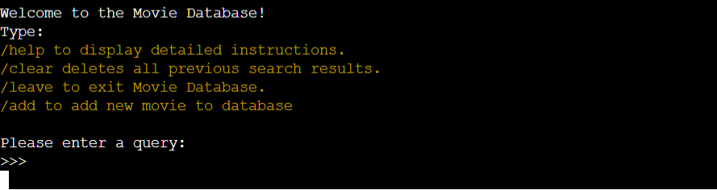

User stories covered by this screen:
1, 2, ,5, 6, 7, 9, 10

### Detailed Instructions

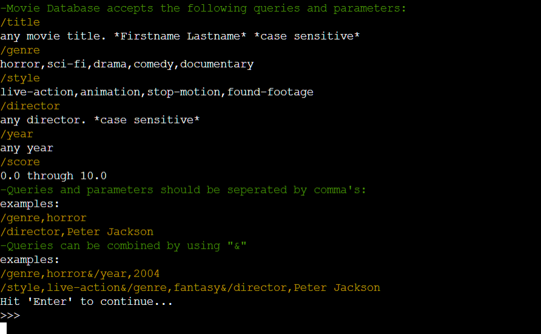

User stories covered by this screen:
1,7

### Clear Results Prompt

User storie covered by this screen:
5

### Add New Movie Menu

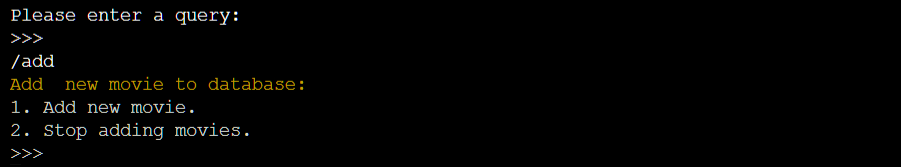

User stories covered by this screen:
6, 9

### Add New Movie Process

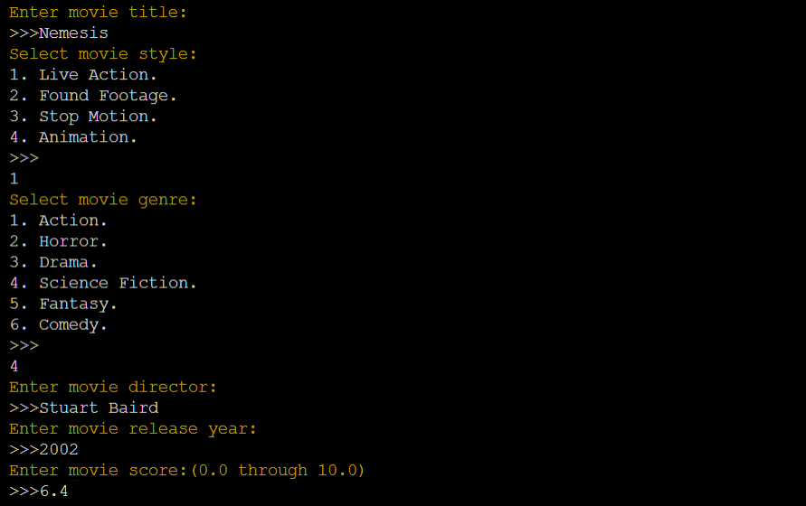
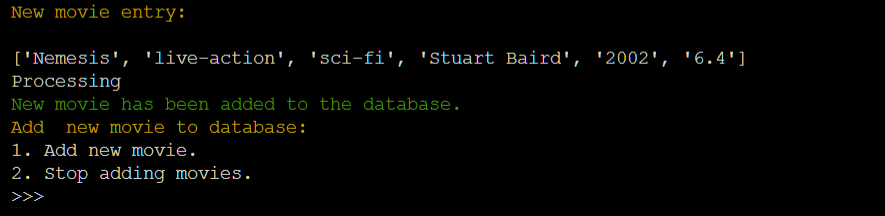

6, 9, 11

[Back to Table Of Contents](#table-of-contents)

## Validation

### Python Validation
All Python code  was validated using PEP8 Validation Service.  All Code passed with 0 errors.
A single alert was flagged noting the use of the 'global' stated.
This was done to allow acces to the global variable 'RESULTS' from within the user_authentication() function.
'RESULTS' was named using uppercase to comply with pep8 styling even though it is technically not a constant
as it is first assigned an empty worksheet at declaration wich is then changed to the user specific worksheet during
user authentication making it a variable rather then a constant.

Any further development of this application would include reworking the user authentication functionality to avoid this.

run.py

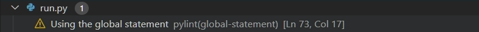

### Testing user stories

1. As a first-time user I want to easily learn how the application works.

| **Feature** | **Action** | **Expected Result** | **Actual Result** |
|-------------|------------|---------------------|-------------------|
|Main interface|type /help | User is presented with detailed instructions|works as expected|

Screenshot

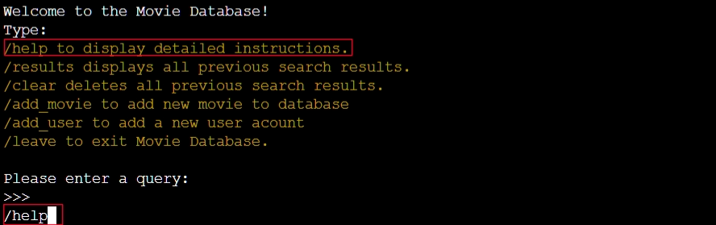

Screenshot

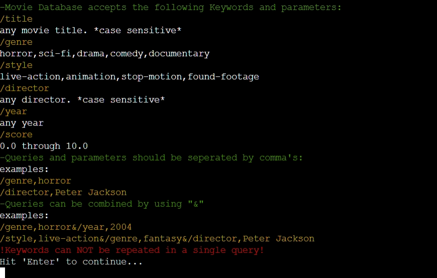

2. As a user I want to be able to search for a specific movie based on given data and see the results immediatly.

| **Feature** | **Action** | **Expected Result** | **Actual Result** |
|-------------|------------|---------------------|-------------------|
|Main interface|enter query| Search results are displayed|works as expected|

Screenshot

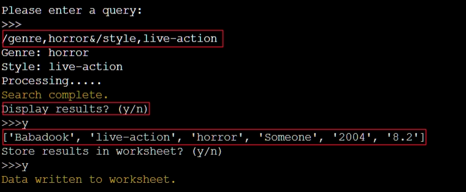

3. As a user I want to be able to build a personal database of search results.

| **Feature** | **Action** | **Expected Result** | **Actual Result** |
|-------------|------------|---------------------|-------------------|
|Login Screen|Enter login| Personal worksheet accessed|works as expected|
|Main interface|enter query|Get option to store results|works as expected|

Screenshot

Screenshot

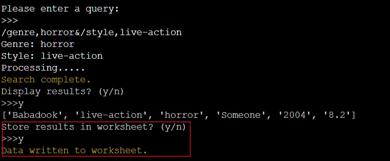

4. As a user I want to be able to review my previous search results.

| **Feature** | **Action** | **Expected Result** | **Actual Result** |
|-------------|------------|---------------------|-------------------|
|Main interface|type /results| Previous searches are displayed|works as expected|

Screenshot

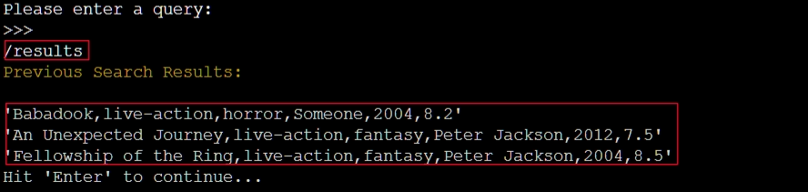

5. As a user I want to have the option to delete previous search results.

| **Feature** | **Action** | **Expected Result** | **Actual Result** |
|-------------|------------|---------------------|-------------------|
|Main interface|type /clear| Previous searches are deleted|works as expected|

Screenshot

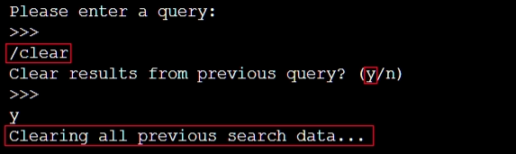

6. As a user I want to be able to add a new movie to the database.

| **Feature** | **Action** | **Expected Result** | **Actual Result** |
|-------------|------------|---------------------|-------------------|
|Main interface|type /add_movie| Go to add movie menu|works as expected|
|Add movie menu|Select option 1 |Start entering movie details| Works as expected|

Screenshot

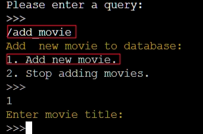

Screenshot

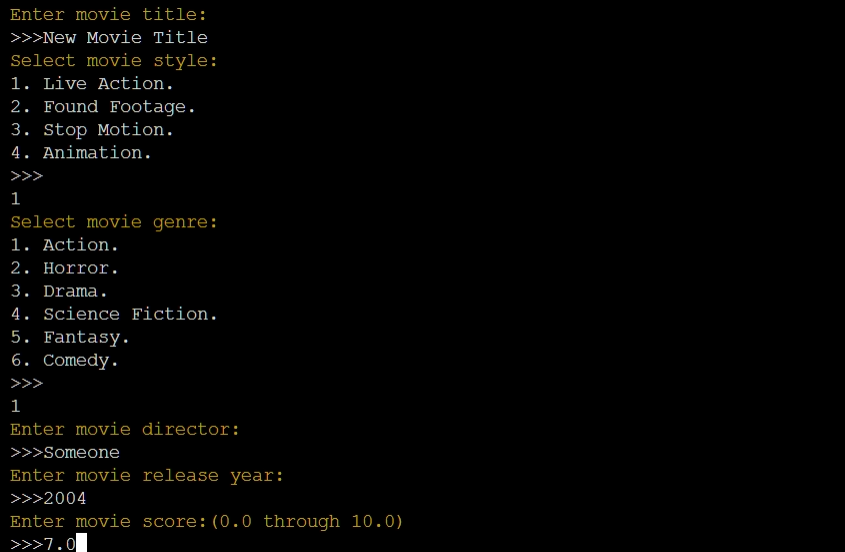

7. As the site owner I want users to be able to easily search the database.

| **Feature** | **Action** | **Expected Result** | **Actual Result** |
|-------------|------------|---------------------|-------------------|
|Main interface|Enter search parameters| Results are displayed|works as expected|

Screenshot

8. As the site owner I want search results to be stored inside a google sheet.

| **Feature** | **Action** | **Expected Result** | **Actual Result** |
|-------------|------------|---------------------|-------------------|
|Main interface|Enter search parameters| Receive prompt to store results|works as expected|

Screenshot

9. As the site owner I want user to be able to add Movies to the database.

| **Feature** | **Action** | **Expected Result** | **Actual Result** |
|-------------|------------|---------------------|-------------------|
|Main interface|type /add_movie| Go to add movie menu|works as expected|
|Add movie menu|Select option 1 |Start entering movie detials| Works as expected|

Screenshot

Screenshot

10. As the site owner I want to be able to add a new user to the system.

| **Feature** | **Action** | **Expected Result** | **Actual Result** |
|-------------|------------|---------------------|-------------------|
|Main interface|Type: /add_user|Go to add user menu|works as expected|
|Add user menu|Enter valid user details|User is created| Works as expected|

11. As the site owner I want every new database entry to follow the correct format.

| **Feature** | **Action** | **Expected Result** | **Actual Result** |
|-------------|------------|---------------------|-------------------|
|Add movie menu|Select option 1 |Receive instructions on making new entry| Works as expected|

Screenshot

12. As the site owner I want restrict use of the application to registered users.

| **Feature** | **Action** | **Expected Result** | **Actual Result** |
|-------------|------------|---------------------|-------------------|
|Login Screen|Enter valid login|Login accepted |works as expected|
|Login Screen|Enter invalid login|Login rejected |works as expected|

Screenshot

Screenshot

[Back to Table Of Contents](#table-of-contents)

## Deployment

### Heroku

This application has been deployed from GitHub to Heroku.
The following steps were taken:

1. Create or log in to your account at heroku.com
2. Create a new app, add a unique app name (this project is named "movie-database-gm") and choose your region
3. Click on create app
4. Go to "Settings"
5. Under Config Vars store any sensitive data you saved in .json file. Key: CREDS, Value: copy the .json file and paste it to 'Value' field.
6. Under Config Vars add a key 'PORT' with value '8000'.
7. Add required buildpacks (further dependencies). For this project, use 'Python' and 'node.js' in that order.
8. Go to "Deploy" and select "GitHub" in "Deployment method"
9. To link up our Heroku app to our Github repository code enter your repository name, click 'Search' and then 'Connect' when it shows below
10.  Choose the branch you want to buid your app from
11. If prefered, click on "Enable Automatic Deploys", which keeps the app up to date with your GitHub repository
12. Wait for the app to build. Once ready you will see the “App was successfully deployed” message and a 'View' button to take you to your deployed link.

Heroku Login

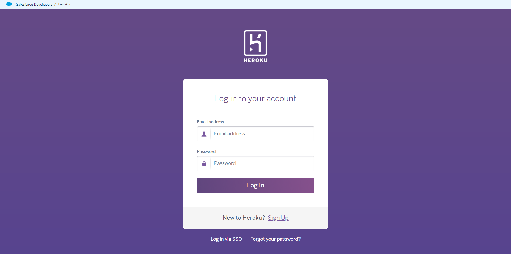

New Project

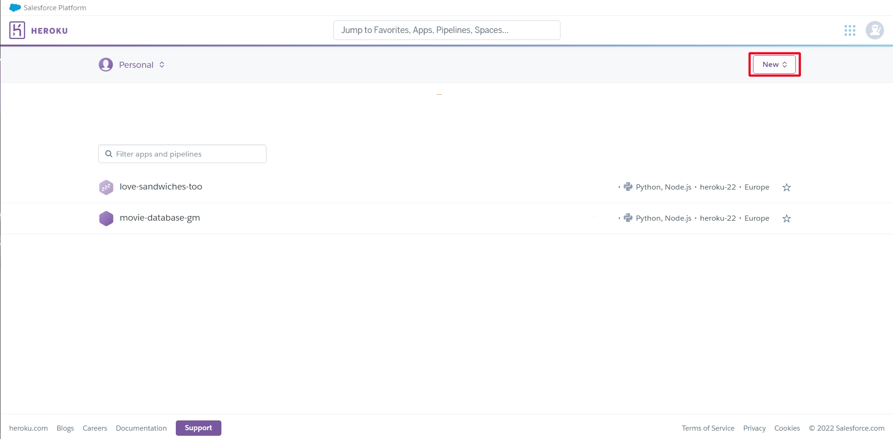

Config Vars

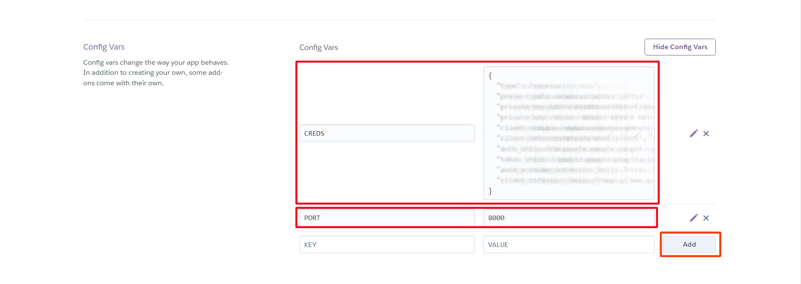

Buildpacks

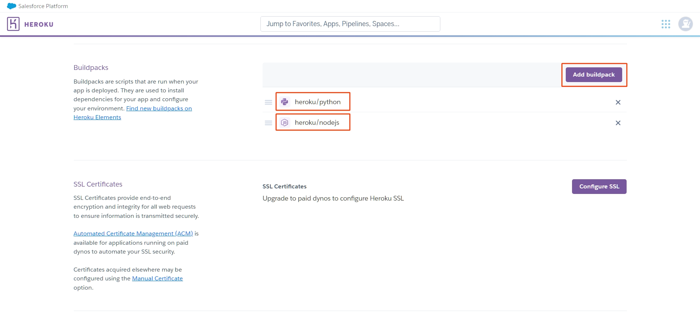

Deployement

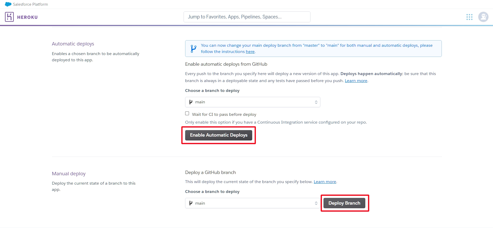

### Forking the GitHub Repository 

By forking this GitHub repository you are creating a copy to view or make changes without affecting the original. You can do this by following these steps...

1. Log into your GitHub account and find the [repository](https://github.com/G-Milzink/CI_PP3_MD).
2. Click 'Fork' (last button on the top right of the repository page).
3. You will then have a copy of the repository in your own GitHub account. 

### Making a Local Clone

1. Log into your GitHub account and find the [repository](https://github.com/G-Milzink/CI_PP3_MD).
2. Click on the 'Code' button (next to 'Add file'). 
3. To clone the repository using HTTPS, under clone with HTTPS, copy the link.
4. Then open Git Bash.
5. Change the current working directory to where you want the cloned directory to be made.
6. In your IDE's terminal type 'git clone' followed by the URL you copied.
7. Press Enter. 
8. Your local clone will now be made.

## Credits

### Code

- **Code Institute** - for git template IDE and heroku deployment instructions.
- **Google** - for library [gspread](https://docs.gspread.org/en/latest/) and [APIS](https://developers.google.com/sheets/api)

## Acknowledgements
I would like to take the opportunity to thank:
- My mentor Mo Shami for his feedback, advice, guidance and support.
- My partner Geertje van der Zalm for her support, inspiration and patience.
- My mother Anne Rijsdijk and her husband Mickel Pereira for helping me persue this dream.
- Anyone who spends time on the internet making tutorials, awnsering questions or otherwise helping others to learn.

[Back to Table Of Contents](#table-of-contents)