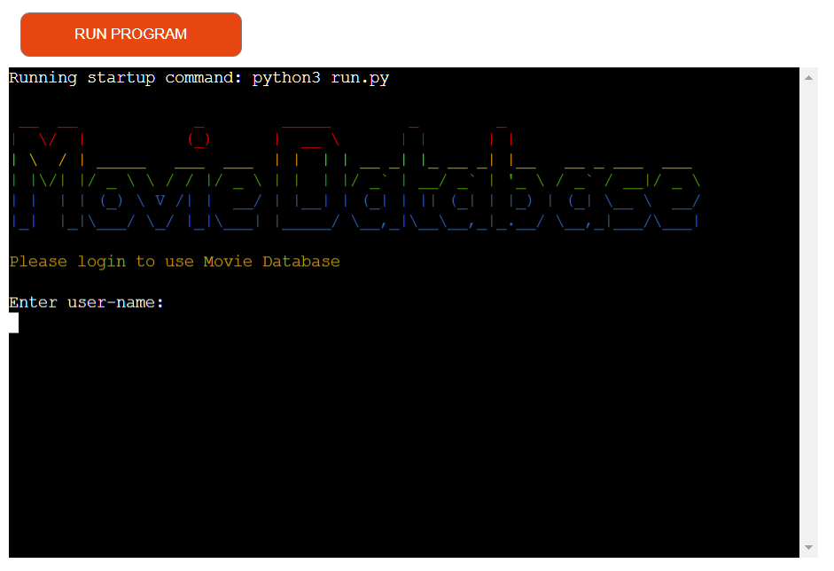
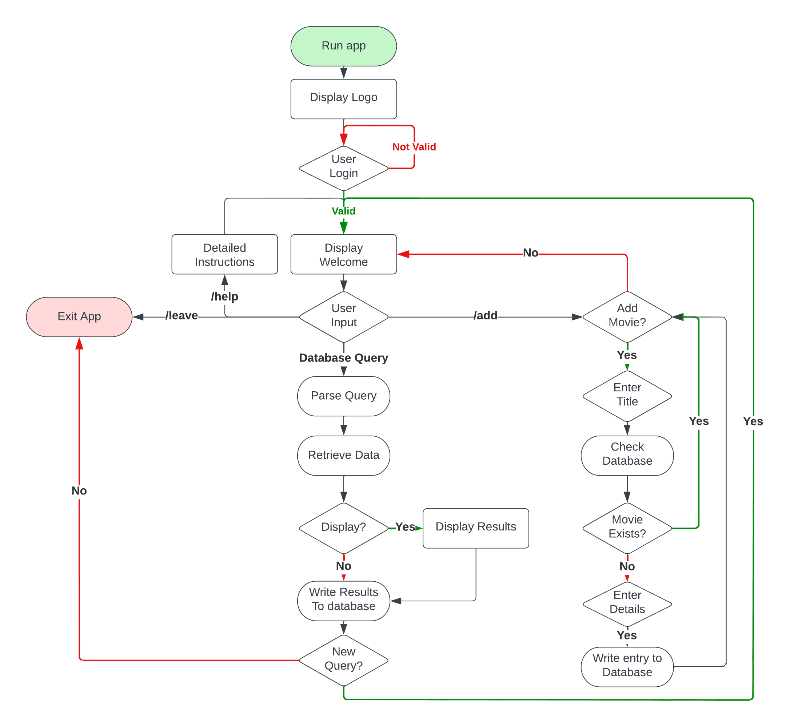

# Movie Database
(Developed by G.Milzink)

[Live Site](https://https://movie-database-gm.herokuapp.com/)

## Table of Contants

1. [Project Goals](#project-goals)
    1. [User Goals](#user-goals)
    2. [Site Owner Goals](#site-owner-goals)
2. [User Experience](#user-experience)
    1. [Target Audience](#target-audience)
    2. [User Stories](#user-stories)
    3. [User Manual](#user-manual)
3. [Technical Design](#technical-design)
    1. [Flowchart](#flowchart)
    2. [Design](#design)   
4. [Technologies Used](#technologies-used)
    1. [Languages](#languages)
    2. [Frameworks and Tools](#frameworks-and-tools)
5. [Features](#features)
6. [Testing](#validation)
    1. [Python Validation](#Python-validation)
    2. [Testing user stories](#testing-user-stories)
7. [Bugs](#Bugs)
9. [Deployment](#deployment)
10. [Credits](#credits)
11. [Acknowledgements](#acknowledgements)

## Project Goals

- The projects main goal is to provide the user with an easy way to search an external database of movies using speceific criteria such as "director" and year of release.
- It allows the user to string together queries to perform complex searches inside the database.
- It allows users to enter movies into the database.

### User Goals

- The abillity to search a database for one or more movies based on certain specific criteria.
- The abillity to add movies to the database.

### Site owner goals
- Create an application that allows the user to easily find or add movies in a database.
- Create an application that is easy to use and provides clear feedback to the user.

## User Experience

### Target Audience
- Movie Enthousiasts.

### User Stories

#### User
1. As a first-time user I want to easily learn how the application works.
2. As a user I want to be able to search for a specific movie based on given data and see the results immediatly.
3. As a user I want to be able to review my previous search results.
4. As a user I want to have the option to keep or delete previous search results.
5. As a user I want to be able to add a new movie to the database.

#### Site Owner
6. As the site owner I want users to be able to easily search the database.
7. As the site owner I want search results to be stored inside a google sheet.
8. As the site owner I want user to be able to add Movies to the database.
9. As the site owner I want every new entry to follow the correct format.

### User Manual

Instruction manual

#### Overview

#### Section 1

#### Section 2

#### Section 3

## Technical Design

### Flow Chart

Flowchart

### Design

## Technologies Used

### Languages

- [Python3](https://python.org)

### Frameworks and Tools

1. [GitPod](https://gitpod.io) - Cloudbased Development Environment
2. [GitHub](https://github.com) - GitHub was used as a remote repository to store project code.
3. [LucidChart](https://lucid.app)
4. [Google Sheets](https://www.google.co.uk/sheets/about/) - was used to store data externaly.
5. [Google Cloud Platform](https://cloud.google.com/cloud-console/) - was used to manage access and permissions to the google services, google auth, sheets etc.

#### Libraries

1. sys - used to allow user to terminate the program.
2. getpass - used to hide User password during/after entry.

### Third party libraries

1. [Colorama](https://pypi.org/project/colorama/) - JUSTIFICATION: Used to add color to the terminal improving application feedback and overall readability and improve the user experience.

2. [gspread](https://docs.gspread.org/en/latest/) - JUSTIFICATION: Used to store main body of data comprising the database, messages to display to user, search results and user login details in a googlew spreadsheet.
3. 6. [Google Cloud Platform](https://cloud.google.com/cloud-console/) - was used to manage access and permissions to the google services, google auth, sheets etc.
