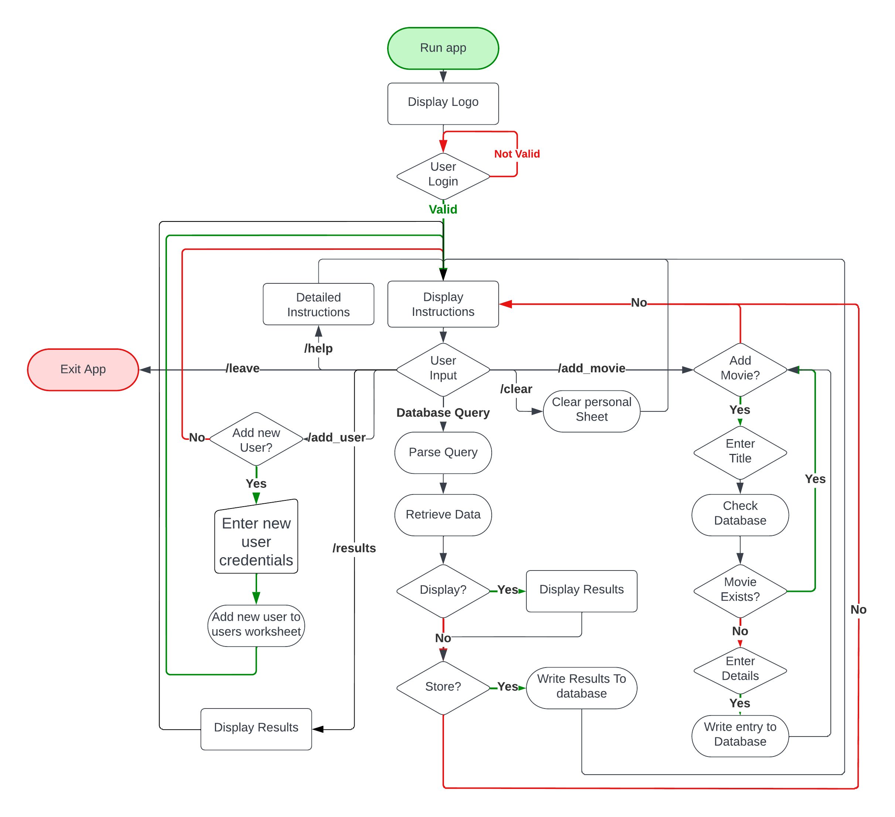

# Movie Database
(Developed by G.Milzink)

[Live Site](https://https://movie-database-gm.herokuapp.com/)

## Table of Contants

1. [Project Goals](#project-goals)
    1. [User Goals](#user-goals)
    2. [Site Owner Goals](#site-owner-goals)
2. [User Experience](#user-experience)
    1. [Target Audience](#target-audience)
    2. [User Stories](#user-stories)
    3. [User Manual](#user-manual)
3. [Technical Design](#technical-design)
    1. [Flowchart](#flowchart)
    2. [Design](#design)   
4. [Technologies Used](#technologies-used)
    1. [Languages](#languages)
    2. [Frameworks and Tools](#frameworks-and-tools)
5. [Features](#features)
6. [Testing](#validation)
    1. [Python Validation](#Python-validation)
    2. [Testing user stories](#testing-user-stories)
7. [Bugs](#Bugs)
8. [Deployment](#deployment)
9. [Credits](#credits)
10. [Acknowledgements](#acknowledgements)

## Project Goals

- The projects main goal is to provide the user with an easy way to search an external database of movies using specific criteria such as "director" and year of release.
- The application will allow the user to string together queries to perform complex searches inside the database.
- The application will allow the user to keep/review/delete previous search results.
- The application will allow the user to enter movies into the database.
- The application will allow any registered user to add a new user to the system.

### User Goals

- The abillity to search a database for one or more movies based on certain specific criteria.
- The abillity to keep/review.delete past search results.
- The abillity to add movies to the database.

### Site owner goals
- Create an application that allows the user to easily find or add movies in a database and create a personal list of movies wich can be reviewed later.
- Create an application that is easy to use and provides clear feedback to the user.

## User Experience

### Target Audience
- Movie Enthousiasts.

### User Stories

#### User
1. As a first-time user I want to easily learn how the application works.
2. As a user I want to be able to search for a specific movie based on given data and see the results immediatly.
3. As a user I want to be able to review my previous search results.
4. As a user I want to have the option to keep or delete previous search results.
5. As a user I want to be able to add a new movie to the database.

#### Site Owner
6. As the site owner I want users to be able to easily search the database.
7. As the site owner I want search results to be stored inside a google sheet.
8. As the site owner I want user to be able to add Movies to the database.
9. As the site owner I want to be able to add a new user to the system.
9. As the site owner I want every new entry to follow the correct format.

### User Manual

Instruction manual

#### Overview

The Movie Database has been designed to allow the user to easily search a large database of movies based on parameters such as  the movies title, director and year of release among others.
The application also allows the user to add movies to the database.
Upon running the application, the user is first greeted by the logo screen.

#### Login

Below the logo screen the user will find a prompt asking for a user name.
This request will repeat untill a valid user name is provided.
Once a valid user name is received the application will prompt the user to enter the associated pasword. Upon receiving a valid password the application wil continue.
If the password provided is not valid the login process will reset to allow the user to try again.

For testing purposes and initial setup the following login has been provided.
User name: md_admin
Password: md_password

#### Main Interface

After login a welcome message will be displayed followed by instructions on the basic syntax for the interface.
The application will then prompt the user to provide instructions.

The Main Interface accepts the following top level commands:
- **/help** will display detailed instructions on program operation
- **/results** displays all previous search results.
- **/clear** will prompt the user to delete *all* previous search data.
- **/add** allows the user to add a movie to the database.
(movie title *must* be unique)
- **/add** to add a new user acount.
- **/leave** will exit Movie Database.

The Main Interface accepts the following search parameters:
- **/title**
any movie title. *case sensitive*
- **/genre**
horror,sci-fi,drama,comedy,documentary
- **/style**
live-action,animation,stop-motion,found-footage
- **/director**
any director. *case sensitive*
- **/year**
any year
- **/score**
0.0 through 10.0

Queries and parameters should be seperated by comma's:
- /genre,horror
- /director,Peter Jackson

Queries can be combined by using "&"
examples:
- /genre,horror&/year,2004
- /style,live-action&/genre,fantasy&/director,Peter Jackson

#### Add Movie

#### Clear Results Prompt

## Technical Design

### Flow Chart

Flowchart

### Design

## Technologies Used

### Languages

- [Python3](https://python.org)

### Frameworks and Tools

1. [GitPod](https://gitpod.io) - Cloudbased Development Environment
2. [GitHub](https://github.com) - GitHub was used as a remote repository to store project code.
3. [LucidChart](https://lucid.app) - LucidChart was used to create the flowchart for the application
4. [Google Sheets](https://www.google.co.uk/sheets/about/) - was used to store data externaly.
5. [Google Cloud Platform](https://cloud.google.com/cloud-console/) - was used to manage access and permissions to the google services, google auth, sheets etc.

#### Libraries

1. sys - used to allow user to terminate the program.
2. getpass - used to hide User password during/after entry.

### Third party libraries

1. [Colorama](https://pypi.org/project/colorama/) - JUSTIFICATION: Used to add color to the terminal improving application feedback and overall readability and improve the user experience.

2. [gspread](https://docs.gspread.org/en/latest/) - JUSTIFICATION: Used to store main body of data comprising the database, messages to display to user, search results and user login details in a googlew spreadsheet.
3. [Google Cloud Platform](https://cloud.google.com/cloud-console/) - JUSTIFICATON: Used to manage access and permissions to the google services, google auth, sheets etc.

## Features

### Logo

### Login Screen

### Main Interface

### Detailed Instructions

### Clear Results Prompt

### Add New Movie Menu

### Add New Movie Process
